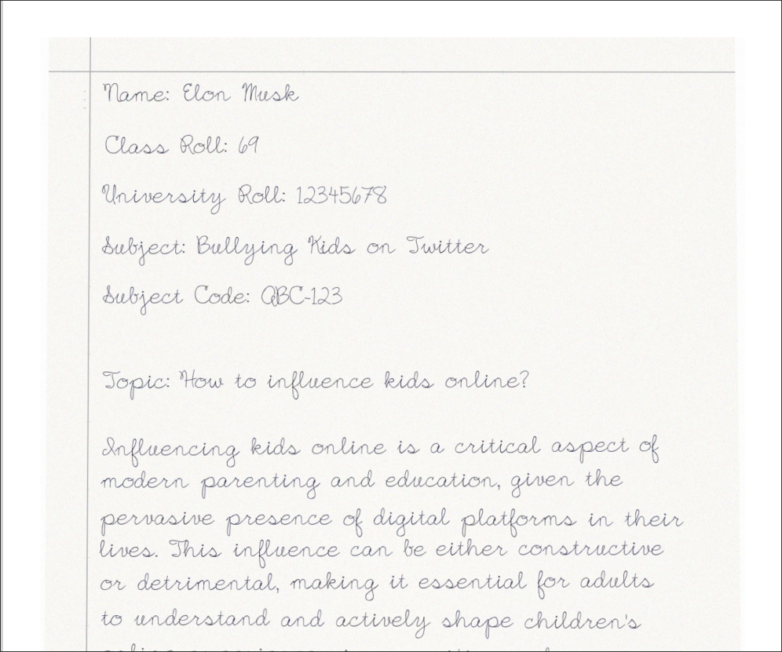

# F\*ck handwritten assignments 😡

Transform your typed text into realistic handwritten documents instantly! This project generates authentic-looking handwritten assignments with pencil margins, paper texture, and natural writing variations.

**Perfect for university assignments cuz who tf wants to write by hand????!**

## Target Audience

**MAKAUT / University Students** who need to submit handwritten assignments but prefer typing (You don't really need to type here!

_Because we all hate writing lengthy assignments by hand..._ 🙄

## Quick Start

### Prerequisites

- Docker & Docker Compose
- Gemini API Key from [Google AI Studio](https://aistudio.google.com/app/apikey)

### Installation

1. **Clone the repository:**

   ```bash
   git clone https://github.com/yourusername/text-to-handwriting.git
   cd text-to-handwriting
   ```

2. **Set up your Gemini API key:**

   paste your gemini key in the route body or env.

3. **Build and run with Docker:**

   ```bash
   docker-compose up --build
   ```

4. **Access the API:**
   Open your browser and go to: **http://localhost:8000/docs#/**

## Usage

1. Navigate to **http://localhost:8000/docs#/**
2. Find the `/generate-assignment` route
3. Fill in the required fields:
   - **BODY**
   ```json
   {
     "name": "string",
     "class_roll": "string",
     "university_roll": "string",
     "subject_name": "string",
     "subject_code": "string",
     "question_topic": "string",
     "output_filename": "string",
     "gemini_api_key": "string",
     "other_details": "string"
   }
   ```
   - **Other details** (optional - additional details at the top of the file)
4. Hit **Execute** and download your handwritten PDF!

## 📸 Sample Output

Here's what the generated handwriting looks like:


_Natural handwriting with pencil margins, paper texture, and realistic variations_

## Project Structure

```

text-to-handwriting/
├── src/
│ ├── main.py # FastAPI application
│ ├── text_processor.py # Text processing logic
│ ├── handwriting_generator.py # Core handwriting generation
│ └── pdf_converter.py # PDF creation with compression
├── fonts/ # Handwriting font files
├── docker-compose.yml # Docker configuration
├── Dockerfile # Container setup
├── pyproject.toml # Dependencies
└── README.md

```

## Contributing

Contributions are welcome:

- Pwease star the repo first 😭
- feel free to use this repo however you want this isn't under any license
- feel free to add some good fonts under the fonts directory, if you can convert your handwriting to a font it is highly appreciated.
